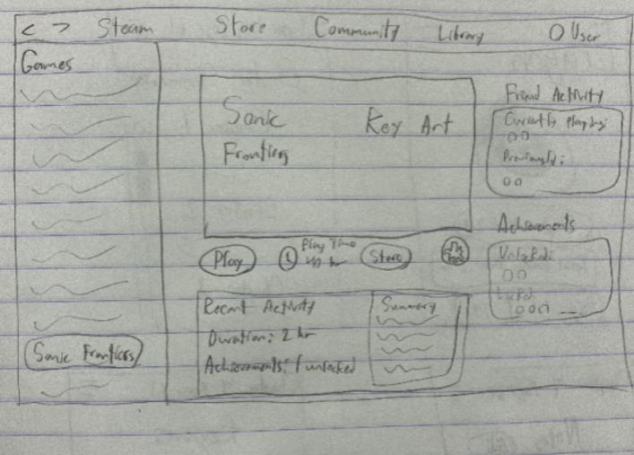
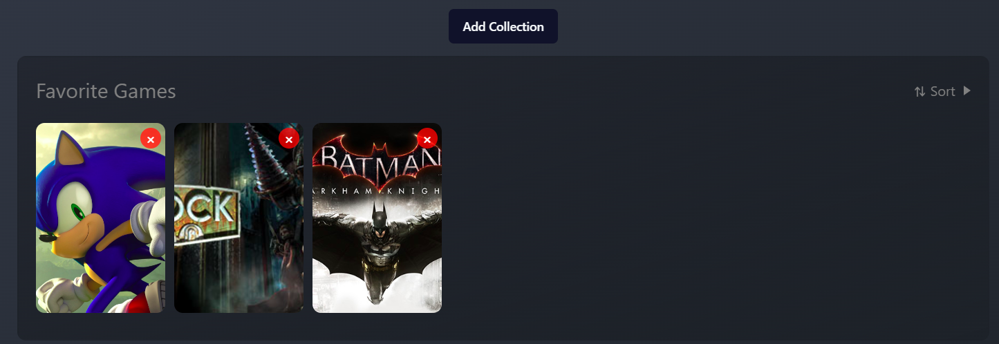
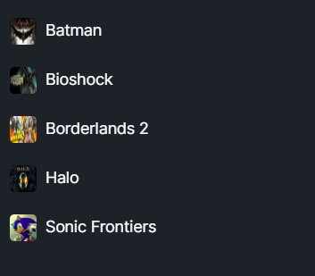

# Steam Redesign

We decided to do a web-based redesign of the current Steam library. With the redesign, we hoped to help users organize, manage, and interact with their games in a better way than how Steam handles it currently. The new application offers a revamped “Collections” feature which allows the users to sort their games by categories such as “Recent Games”, “Installed Games”, and any other idea the user might think of. The ability to drag and drop games into new user-specified collections gives infinite possibilities of game collections. Beyond this, the “News and Updates” page is much more catered to the games in the collection, along with being able to modify these notifications. Finally, the revamped game page gives more life to each game, along with giving real-time stats to compare with friends.

---

## Design Work

### Research

#### Interviews

1. **How often do you use your Steam Library, and what do you use it for?**
   - **a.** I use it almost every day to launch games. Mostly, I'm just getting in there to play, but sometimes I check for updates if a game isn't running smoothly.
   - **b.** Probably a few times a week. Mostly, I'm managing downloads or updates, especially when I buy a bunch of games during a sale. I use collections to organize everything.
   - **c.** Honestly, I'm on Steam daily. I like browsing through my library, especially older games I haven't played in a while. It helps me decide what to revisit.

2. **What is the most frustrating thing for you about the current Steam Library?**
   - **a.** The Collections feature is kinda clunky. It is not that intuitive, and organizing my games feels more like a chore than anything.
   - **b.** I hate how basic the Downloads page is. If I have multiple updates going on, it's hard to tell what is actually downloading, and I can't prioritize updates easily.
   - **c.** It's just slow. Switching between views takes forever, and the search bar doesn't always pull up games I know I own. It gets annoying when all I wanna do is find something quick.

3. **If you could change one thing about the Steam Library, what would it be?**
   - **a.** I would make it easier to organize my games. Like, tag or filter them to sort, so I could save a lot of time.
   - **b.** The Downloads part really needs an update. Let me queue the updates and prioritize what's downloading. At present, it is too messy.
   - **c.** I really wish I could customize the layout more. Yeah, it has some customization already but really just the order of things…

4. **How about Collections? Does that help or not?**
   - **a.** It's okay, but it could really be much better. I attempted to categorize by genres and that proves to be just too much for me. It would be great if Steam could propose categorizations based on what I have played.
   - **b.** I use it. It feels like a half-baked product. Drag-and-drop of games is almost a little pain, and it would be great if there were more options than what they have for categorization. I don’t really care about the genre of a game, I care about how much I play it etc.
   - **c.** I hardly ever use it. It's too much of a hassle to set up Collections, and I don't really see the point. Usually, I just use the search bar.

5. **How do you feel about the Downloads window in the Library?**
   - **a.** It does the job… I've never had an issue with it.
   - **b.** I feel like whenever I'm downloading multiple things it takes WAY longer than just doing each one by one. The queue seems to slow it down.
   - **c.** Honestly, pretty outdated. It's not super clear which ones are really downloading vs. just queued up. More control over that would be great.

6. **Would you like there to be more options to personalize your Steam Library—for example, have the ability to change the appearance or even show/hide sections?**
   - **a.** Oh, absolutely, so I can hide stuff I never use, and make it a bit more simple. I want to see just my favorite games clearly there.
   - **b.** Yeah, 100%. It'd be nice to have it somehow rearrange, or have some kind of compact view, where I only show my most-played games. That would make things a hell of a lot easier.
   - **c.** Definitely. Being able to pin certain games or sections around would save me a great deal of scrolling, especially when I'm looking for something specific.

#### User Metrics

- Users frequently report feeling overwhelmed by the lack of intuitive filters and search options, making it hard to locate specific games quickly.
- Users feel the current design is visually cluttered or uninviting, impacting overall satisfaction.
- Users with larger libraries (50-100+ games) report being unsatisfied with the current Library organization options.
- One user stated that the “UI genuinely looks horrible.”

#### User Survey

- Most users do not use the Steam library daily, with most ranging from a few times a week to rarely.
- Most users use the Steam library to launch games and manage downloads/updates.
- Most users do not find it very easy to find games in the Steam library.
- With an average of 3.29 stars, the average user is not very satisfied with the current organization of the Steam library.
- Most users do not find the Library Collections super useful for organizing games.
- Most users do not find the current Downloads page very clear.
- Most users would prefer more control over how the Steam library is organized.
- Most people want faster loading times or more customization of the library loadout.

### Methods

For our research, we did background research on current issues with Steam’s library noted by people, user interviews with people who currently use Steam on a weekly or daily basis, and a survey to gauge the general feelings users have towards the UI on a holistic scale.

### Findings

- A common complaint of users was the poor aesthetic of Steam, with a specific part being the blur effect on the game page.
- Hard for users to find games in their library; when needing to find one, they sometimes had to scroll for multiple seconds before finding their selection.
- When trying to use the search bar, users found it wasn’t very obvious/prominent as an option, making it hard to use.
- Collections have too much hassle when trying to create them; users complained about the lack of labeling for the option and the multiple windows that they have to go through to create one.
- News component of the library was found to be redundant/unhelpful by most users.

### Design Choices

- **Move the news section** of the library into its own unique tab so that users can choose when to view it.
- **Make collections the default page** of the library to create a seamless experience for users to create and edit collections without jumping through windows.
- **Making collections more prominent** will allow users to not have to rely on the sidebar as much to find games, making it easier on users who may potentially have a very long list in the sidebar.
- **Create a second header for the library** to contain the search bar and filter options to make them more prominent for a user to use.
- **Remove the blur effect** on the game background in the game page, organize the page to keep all elements on the same page to keep it focused and not too complicated/cluttered.
- **Add a ‘Recent Activity’ section** to the game page to give another way for developers to showcase information about the game that can actually benefit the users.
- **Remove unused portions of the game page** based on user experience, such as the general activity section and trading cards.

### Sketches

.png>)
.png>)
.png>)
.png>)
.png>)

## Interface Controls

#### Main Components

- **Choice of tab (Collections vs. News)**
  - Easily allows switching between the different sections, and the current section is highlighted for easy comprehension.

- **Sort and collapse button**
  - Allows the user to reverse the order of sorting for the collections/news, alongside easily collapsing any section if it is not needed.

- **Game icon**
  - The game icon allows the user to clearly see what game is there, alongside a red "X" at the top to easily remove the game from any given collection.

- **Add Collection button**
  - Clearly shows that a new collection can be added, with a popup dialog to provide some directions to the user.

- **Sorting for news**
  - Allows the user to sort by date and alphabetically, along with a collapse button for easy reading of news stories.

- **Friend activity**
  - Shows current friends playing the game, along with those who aren’t playing but have played recently. Hovering over their icon shows the gamertag.

- **Achievements**
  - Similar to friends playing, it shows locked and unlocked achievements along with their icon. Allows the user to hover over it to get further information about the achievement.

- **DLC**
  - Shows available DLCs and allows the user to hover over for more info.

- **Recent activity and stats**
  - Shows the user recent activity such as duration played, total achievements, screenshots taken, and how many friends you have played with. It also gives a summary and last time played.

- **Sidebar**
  - Provides all available games. Supports drag and drop into collections for easier game management. Clicking on a game brings the user to the game page.

- **Sidebar sorting**
  - Includes sorting by recent, sorting by installed, and alphabetically. All provide easier game management.

- **Sidebar search**
  - Allows the user to easily search for a specific game/games. Easily readable.

### Code Implementation

For this project, we upgraded to use the latest version of Svelte, **Svelte 5**. The main things we ended up leveraging from this were the improved state management hooks as well as the ability for a parent component to bind to a value stored in a child component, which is how the search bar works. For the games that we show, we created an array of objects with a very long set of attributes to ensure that every field on the game page had data to use to display. The actual application was broken up into the Steam header, the Library header, the games sidebar, and the main content section which itself swaps between the collections, news, and game page components.

### Use of AI

Jacob used AI here and there again to help with implementation. When using AI, you definitely need to be careful as sometimes it can cause more harm than good. But with that being said, when used properly it is a great tool. For example, it was fantastic for extrapolating the data from one of the game pages to create game pages for the rest. This brought a multiple-hour process into less than 30 minutes of work. When used properly, it will make you a much more efficient coder.

### Future Work

As one of our main goals was customizability, there are still many other features that could be added to continue improving this. The collections page can have ways to rename and delete each collection, as well as being able to change the order of how collections appear on the screen.

---

## Demo & Links

- **Demo Video:** [Watch the Demo](https://drive.google.com/file/d/1QZ5TfqHP1NH52qSwgcmKw9YGuGAHKy_N/view?pli=1)
- **Public Link:** [steam-library-redesign.vercel.app](https://steam-library-redesign.vercel.app/)
